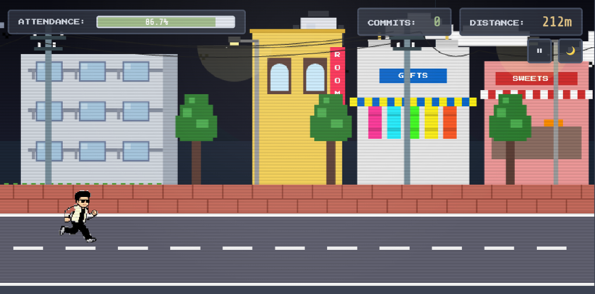
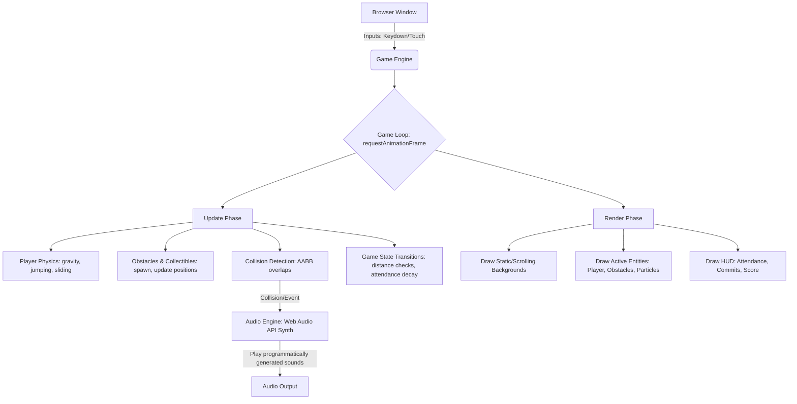

# Viva or Void 🏃‍♂️🎓

[](https://developer.mozilla.org/en-US/docs/Web/API/Canvas_API)
[](https://developer.mozilla.org/en-US/docs/Web/JavaScript)
[](https://developer.mozilla.org/en-US/docs/Web/API/Web_Audio_API)
[](https://opensource.org/licenses/MIT)

**Viva or Void** is a level-based 2D side-scrolling retro runner game built entirely using **HTML Canvas**, **Vanilla JavaScript**, and **CSS3**. The game follows the morning commute of a B.Tech student running late for a crucial DAA (Design and Analysis of Algorithms) Viva exam. 

The player must navigate complex streets, dodge campus hazards, maintain a passing attendance rate, and face the ultimate boss: the Examiner, in a real-time classroom Viva Q&A showdown.



---

## 🕹️ Play Now
Clone the repository and open `index.html` directly in any browser, or host it statically (GitHub Pages, Vercel, Netlify). 

---

## 🎮 Game Controls
| Key | Action | Context |
| :--- | :--- | :--- |
| **Spacebar** / **W** / **↑** | Jump (Double Jump supported) | In-Game |
| **S** / **↓** | Slide / Duck | In-Game |
| **M** | Toggle Mute | Anywhere |
| **Escape** | Pause / Resume | In-Game |
| **Spacebar** | Select/Confirm/Start | Menus |

---

## 🏗️ Technical Architecture
The game relies on a clean, single-threaded model centered around a deterministic game loop driven by `requestAnimationFrame`.



---

## 🚀 Key Engineering Highlights

### 1. Programmatic 8-Bit Synth (Web Audio API)
Instead of loading external heavy `.mp3` or `.wav` assets, all game audio (chiptune background music, jump sound effects, collision feedback, collection jingles) is generated **programmatically at runtime** using the Web Audio API:
* **Chiptune sequencer**: Plays custom 32-step chord progressions.
* **Low footprint**: Reduces repository size and load times to practically zero.
* **Custom Oscillators**: Utilizes square, triangle, and sine waveforms to replicate classic NES sound chips.

### 2. AABB Collision Detection with Safe Padding
A custom Axis-Aligned Bounding Box (AABB) system computes precise overlap bounds. It includes custom hit-box padding for player-friendly collision boxes, preventing frustrating near-miss crashes:
```javascript
getHitbox() {
    return {
        x: this.x + 4,
        y: this.y + 4,
        w: this.width - 8,
        h: this.height - 8
    };
}
```

### 3. Real-Time Canvas Pixel Manipulation
To integrate pixel art assets cleanly, the engine analyzes and filters sprite images dynamically on load:
* **Background removal**: Detects near-white background colors (RGB > 230) and sets their alpha values to 0.
* **Skin-tone adjustments**: Uses custom pixel-color ranges to programmatically lighten skin tones of retro game characters.

### 4. Adaptive Game Loop & Progression
* **Parallax Scrolling**: Background layers scroll at different speeds based on player distance to give a three-dimensional depth effect.
* **Dynamic Speed Curve**: Speed scales up asymptotically as the player runs further.
* **Milestone Alerts**: Spawns mock WhatsApp popups at key milestones, pausing the action to simulate phone notifications.

---

## 📖 Level System & Design

| Level | Backdrop | Main Obstacles | Win Condition | Gameplay Style |
| :--- | :--- | :--- | :--- | :--- |
| **Level 1** | Parallax City Streets | Stray Dogs, Cows, Rickshaws, Potholes | Run 1000 meters | Standard runner |
| **Level 2** | College Campus Corridor | Backpacks, Benches, Wet Signs, Classmates | Run 250 meters | fast-paced dodging |
| **Level 3** | Computer Lab Classroom | Laser Question Beams, Answer Bubbles | Answer 5 questions | Stationary Boss Fight |

---

## 🛠️ How to Run Locally

### Option A: Open directly
Open `index.html` in your web browser of choice.

### Option B: Local Web Server (Recommended)
Starting a simple HTTP server ensures correct origin policies for canvas pixel manipulation:
```bash
# Python 3
python3 -m http.server 8000

# Node.js (via http-server)
npx http-server . -p 8000
```
Open `http://localhost:8000` in your browser.
